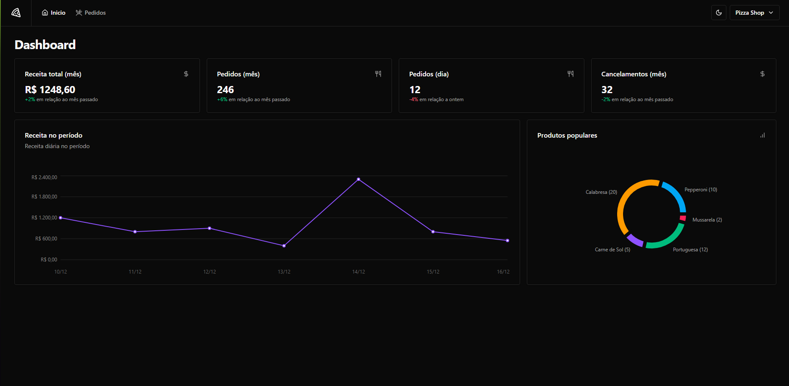
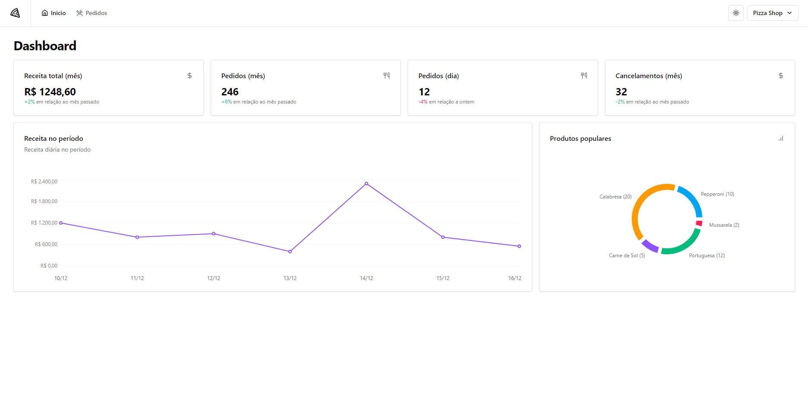

# 🍕 PizzaShop Web






## 📝 Descrição

O **PizzaShop Web** é uma aplicação web desenvolvida para proprietários de pizzarias, permitindo o gerenciamento eficiente de pedidos, acompanhamento de estatísticas de vendas e administração do cardápio. A plataforma oferece uma interface intuitiva para facilitar o controle diário das operações do estabelecimento.

## 🚀 Funcionalidades

- **📋 Gerenciamento de Pedidos**: Visualize, atualize o status e gerencie todos os pedidos em tempo real.
- **📦 Administração do Cardápio**: Adicione, edite ou remova itens do cardápio de forma dinâmica.
- **📊 Estatísticas de Vendas**: Acesse gráficos e relatórios detalhados sobre o desempenho das vendas.
- **🔔 Notificações**: Receba alertas sobre novos pedidos e atualizações importantes.
- **⚙️ Configurações Personalizadas**: Ajuste taxas de entrega, horários de funcionamento e outras preferências do negócio.

## 🛠️ Tecnologias Utilizadas

- **Frontend**:
  - ⚛️ [React](https://react.dev/) ^19.0.0
  - 🏠 [React DOM](https://react.dev/) ^19.0.0
  - 🌐 [React Router DOM](https://reactrouter.com/) ^7.3.0
  - 🪝 [React Hook Form](https://react-hook-form.com/) ^7.54.2
  - 📈 [Recharts](https://recharts.org/en-US/) ^2.15.1
  - 🛠️ [Lucide React](https://lucide.dev/) ^0.479.0
  - 🛡️ [Zod](https://zod.dev/) ^3.24.2

- **Estilização**:
  - 🎨 [Tailwind CSS](https://tailwindcss.com/) ^4.0.13
  - 🔀 [Tailwind Merge](https://github.com/dcastil/tailwind-merge) ^3.0.2
  - 🌀 [Tailwind CSS Animate](https://github.com/tailwindlabs/tailwindcss-animate) ^1.0.7
  - 🧩 [ShadCN UI](https://shadcn.dev/) ^0.9.5
  - 🧙 [CLSx](https://github.com/lukeed/clsx) ^2.1.1
  - 🎛️ [Class Variance Authority](https://cva.style/) ^0.7.1

- **Componentes e Utilitários**:
  - 🎛️ [Radix UI](https://www.radix-ui.com/) (Dialog, Dropdown Menu, Label, Select, Separator, Slot)
  - 📦 [Sonner](https://sonner.emilkowal.ski/) ^2.0.1

- **Ferramentas de Desenvolvimento**:
  - 🧹 [ESLint](https://eslint.org/) ^8.57.1
  - 🛡️ [TypeScript](https://www.typescriptlang.org/) ~5.7.2
  - ⚡ [Vite](https://vitejs.dev/) ^6.2.0

## 🤝 Contribuição

Contribuições são bem-vindas! Siga os passos abaixo para contribuir:

### 🚀 Fluxo Completo de Contribuição

Execute o seguinte comando no terminal (substitua `<seu-usuario>` pelo seu nome de usuário do GitHub):

  1. **Fork** o repositório:

  2. **Clone** o seu fork:
  ```bash
  git clone https://github.com/<seu-usuario>/pizzashop-web.git
  ```

  3. **Acesse a pasta do projeto**:
  ```bash
  cd pizzashop-web
  ```
  4. **Crie uma branch para a sua funcionalidade**:
  ```bash
  git checkout -b minha-feature
  ```
  5. **Faça as alterações e adicione os arquivos modificados**:
  ```bash
  git commit -m "Adiciona nova funcionalidade"
  ```
  6. **Faça as alterações e adicione os arquivos modificados**:
  ```basb
  git add .
  ```
  7. **Faça o commit**:
  ```bash
  git commit -m "Adiciona nova funcionalidade"
  ```
  8. **Envie suas alterações**:
  ```bash
  git push origin minha-feature
  ```


